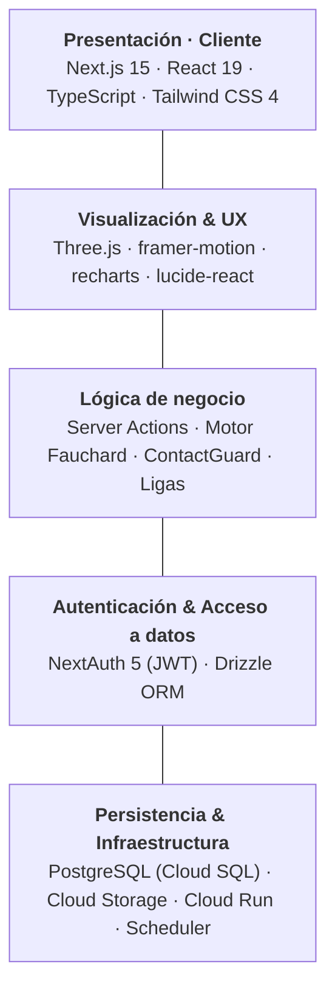

# Slide — Estado actual (Pitch Deck DentFlowAi)

> Contenido para la slide tipo "El sistema ya está construido y operativo".
> Fuente: inventario real del código (server actions, rutas admin, flujos UCH) a 2026-06-10.
> Layout sugerido: 3 columnas (Dentista · Técnico · Admin) + card de stack al pie.

---

## Titular

**ESTADO ACTUAL**
# El sistema ya está construido y operativo

---

## Columna 1 — 👨‍⚕️ Dentista

- Creación de casos: 3 tipos de servicio (diseño, fabricación, integral)
- Carga de modelos 3D + visor 3D con anotaciones por coordenada
- Propuestas anónimas con comparación de ofertas
- Precio final con fee de plataforma ya incluido (flete trasladado 1:1)
- Hub unificado del caso (UCH) con línea de tiempo
- Aprobación de diseño / solicitud de revisiones
- Solicitud de pausa o cancelación del caso
- Confirmación de recepción y cierre
- Republicar, archivar y clonar casos
- Calificación del técnico por dimensión (diseño / fabricación)

## Columna 2 — 🔧 Técnico

- Invitaciones anónimas del motor Fauchard
- Cotiza en precios netos: nunca ve el fee ni el precio del dentista
- Precio único o desglose diseño + fabricación (+ flete aparte)
- Aceptar / rechazar invitaciones (individual y masivo)
- Entregas iterativas con anotaciones y comentarios técnicos
- Fabricación y registro de despacho
- Gestión de disponibilidad (global + CAD/CAM + categorías)
- Sistema de ligas (Bronce · Plata · Oro · Élite)
- Calificaciones por dimensión que ajustan su nivel y liga
- Perfil y habilidades

## Columna 3 — 🛡️ Admin

**Motor Fauchard**
- Configuración de parámetros del algoritmo (con log de cambios)
- Monitor en vivo de casos y selección de técnicos
- Simulador "what-if": prueba parámetros sin ejecutar el proceso real
- Demo guiada y diagrama sandbox del flujo

**Disponibilidad de técnicos**
- Panel de plazos y sanciones (no-respuesta rolling 14 días)
- Cola de espera (pendiente_pool) y reactivación de casos
- Override admin de disponibilidad por técnico

**Motor de ligas**
- Umbrales de ascenso, transición y descenso
- Ranking de técnicos con categoría y estado de transición

**Configuración clínica y operativa**
- Catálogos: color VITA, restauración, material, urgencia (CRUD)
- Calendario laboral: horario hábil + feriados
- ContactGuard: reglas de moderación, allowlist de couriers y auditoría

**Gestión y soporte**
- Usuarios, organizaciones y creación de co-admins
- Impersonación: operar como cualquier usuario
- Observabilidad: dashboard de métricas y KPIs (recharts)
- Zona de riesgo: operaciones administrativas sensibles

---

## Card — STACK TECNOLÓGICO

**Frontend:** Next.js 15 · React 19 · TypeScript · Tailwind 4
**Datos:** Server Actions · Drizzle ORM · PostgreSQL · NextAuth 5
**Infra:** Cloud Run · Cloud Storage · Cloud Scheduler
**Especializado:** Three.js (visor 3D) · recharts · framer-motion

---

## Diagrama de stack — bloques apilados

Versión final lista para el deck: [assets/stack-diagram.svg](assets/stack-diagram.svg)
(estilo de bloques de colores: rieles laterales de cuerpo completo + bloques
superiores + riel vertical Drizzle + barras apiladas con los motores del producto).

Mapeo del layout:
- **Riel izquierdo** → Calidad & Tests (Vitest · Testing Library · ESLint), transversal a todo.
- **Riel derecho** → NextAuth 5 (autenticación), gateway de acceso.
- **Bloques superiores** → FrontEnd / BackEnd · Plataforma (Node/TS/Turbopack/Tailwind) · Three.js + librerías UI.
- **Riel vertical inferior** → Drizzle ORM (capa de datos que opera sobre las barras).
- **Barras apiladas (datos + infra)** → PostgreSQL (Cloud SQL) · Google Cloud Storage · Cloud Run · Cloud Scheduler · EmailJS.
- **Pie** → Entorno local: Docker · fake-gcs-server.

> Nota: el diagrama es solo **stack tecnológico**. Los módulos del producto
> (Motor Fauchard, disponibilidad, ligas, ContactGuard) **no** van aquí — se
> construyeron *con* este stack y pertenecen a un diagrama funcional aparte.

---

## Diagrama de módulos del producto

Archivo: [assets/modules-diagram.svg](assets/modules-diagram.svg)
(mismo estilo de bloques; arquitectura **funcional**, no tecnológica).

Mapeo del layout:
- **Riel izquierdo** → Anonimato estructural (enmascaramiento Fauchard), transversal.
- **Riel derecho** → ContactGuard (moderación anti-desintermediación), transversal.
- **Bloques superiores** → superficies por rol: Dentista · Técnico · Admin.
- **Núcleo (banda dorada)** → Motor Fauchard: orquestación, clasificación y selección.
- **Riel vertical** → UCH (UnifiedCaseHub), la pantalla que renderiza todo el ciclo.
- **Barras apiladas** → ciclo de vida + módulos satélite: gestión de casos · ofertas/cotizaciones · entregas/revisiones/fabricación · disponibilidad · ligas · calificaciones/catálogos/calendario.
- **Pie** → soporte transversal: Notificaciones (EmailJS) · Observabilidad.

Abajo, una versión lineal simplificada (ASCII / Mermaid) de respaldo.

### ASCII (superficie → infraestructura)

```
╔══════════════════════════════════════════════════════════════════╗
║  PRESENTACIÓN · CLIENTE                                             ║
║  Next.js 15 (App Router) · React 19 · TypeScript · Tailwind CSS 4  ║
╠══════════════════════════════════════════════════════════════════╣
║  VISUALIZACIÓN & UX                                                ║
║  Three.js (visor 3D) · framer-motion · recharts · lucide-react     ║
╠══════════════════════════════════════════════════════════════════╣
║  LÓGICA DE NEGOCIO                                                  ║
║  Server Actions · Motor Fauchard · ContactGuard · Motor de Ligas   ║
╠══════════════════════════════════════════════════════════════════╣
║  AUTENTICACIÓN & ACCESO A DATOS                                    ║
║  NextAuth 5 (JWT) · Drizzle ORM                                    ║
╠══════════════════════════════════════════════════════════════════╣
║  PERSISTENCIA & INFRAESTRUCTURA                                    ║
║  PostgreSQL (Cloud SQL) · Cloud Storage · Cloud Run · Scheduler    ║
╚══════════════════════════════════════════════════════════════════╝
```

### Mermaid



---

## Notas para el orador (no van en la slide)

- Todas las capacidades listadas están construidas y con sus feature flags
  encendidos (disponibilidad, rechazo, cola pendiente, ligas).
- El único interruptor de infra apagado a propósito es el envío de correos
  reales (`NOTIFICATIONS_LIVE`): no es una feature de usuario, evita emails
  desde staging con datos clonados. Se activa el día del lanzamiento.
- Anonimato estructural: el dentista nunca ve nombre/precio/cantidad de técnicos;
  el técnico nunca ve a otros técnicos del caso.
- Economía del marketplace: el técnico cotiza neto; el dentista paga el precio con
  fee de plataforma (15% por defecto, configurable). El flete se traslada 1:1 sin fee.
- Pendiente (no presentar como cerrado): el dashboard de Finanzas/pagos está en
  estado mock (valores de ejemplo); la liquidación real aún no está implementada.
