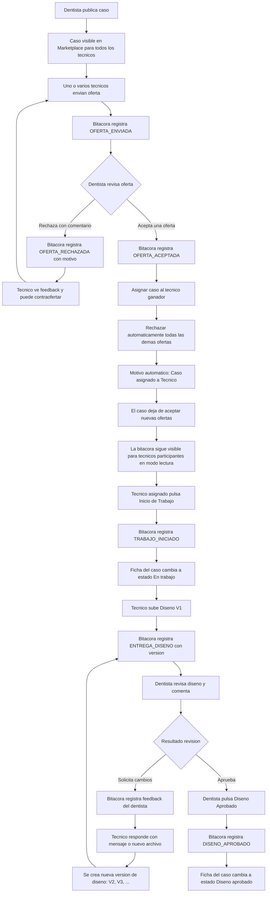

# Workflow Dentista-Tecnico

## Backlog Tecnico Priorizado

Este backlog convierte el workflow objetivo en una hoja de implementacion ordenada por fases, prioridad, dependencia y riesgo. La secuencia propuesta busca atacar primero los cambios que afectan integridad de datos, trazabilidad y consistencia del dominio, y dejar para despues la consolidacion visual y las mejoras de experiencia.

### Criterios De Priorizacion

- P0: Bloquea consistencia funcional, integridad de datos o reglas de negocio criticas.
- P1: Necesario para cerrar el flujo completo sin ambiguedades ni caminos paralelos.
- P2: Mejora profundidad operativa, experiencia de usuario o mantenibilidad, pero puede esperar despues del nucleo.

### Escala De Riesgo

- Bajo: Cambios acotados, facilmente reversibles y con poco impacto transversal.
- Medio: Cambios de varias capas, pero sin alterar estructura critica de datos.
- Alto: Cambios de dominio, migraciones, backfill o reglas que pueden afectar casos historicos.

### Resumen Ejecutivo Por Fases

| Fase | Prioridad | Riesgo | Objetivo | Dependencia de salida |
| --- | --- | --- | --- | --- |
| F0 | P0 | Medio | Cerrar contrato funcional, eventos, permisos y mensajes oficiales | Ninguna |
| F1 | P0 | Alto | Crear base de datos para numero de caso, rondas y control de borrado | F0 |
| F2 | P0 | Alto | Unificar dominio de ofertas, adjudicacion y borrado permitido | F1 |
| F3 | P1 | Alto | Implementar retiro, republicacion y cierre comercial por ronda | F2 |
| F4 | P1 | Medio-Alto | Habilitar acceso historico restringido para tecnicos participantes | F3 |
| F5 | P1 | Medio | Consolidar ficha unica, workflow visible y bitacora unificada | F4 |
| F6 | P2 | Medio-Alto | Versionado de cambios del caso y de entregas tecnicas | F5 |
| F7 | P1 | Medio | Optimizacion de entregas, notificaciones y auditoria | F6 |
| F8 | P1 | Medio | Tablero Kanban de produccion tecnica | F7 |
| F9 | P1 | Alto | Logistica, despacho e integracion con Vevi | F8 |
| F10 | P1 | Medio | Reputacion, cierre financiero y escrow | F9 |

---

## F0. Contrato Funcional Y Reglas Base

**Objetivo**

Dejar cerrado el lenguaje del dominio antes de tocar el modelo de datos y las acciones del sistema.

**Salida obligatoria**

- Taxonomia unica de eventos de bitacora.
- Mensajes oficiales del negocio.
- Matriz de permisos por actor y por estado.
- Regla formal de borrado vs archivo.

**Backlog**

| ID | Prioridad | Item | Riesgo | Dependencias | Entregable | Criterio de cierre |
| --- | --- | --- | --- | --- | --- | --- |
| BL-001 | P0 | Normalizar taxonomia de eventos para ofertas, aceptacion, retiro, republicacion, produccion y aprobacion | Medio | Ninguna | Catalogo de eventos y payloads | Sin duplicados entre backend y UI. Cobertura total de estados. |
| BL-002 | P0 | Definir mensaje oficial de rechazo automatico, mensaje de retiro y mensaje de caso modificado antes de reofertar | Bajo | Ninguna | Constantes de negocio documentadas | Textos aprobados para banners y notificaciones. |
| BL-003 | P0 | Formalizar regla de borrado: solo si no existen transacciones de terceros ni actividad operativa | Medio | Ninguna | Matriz de elegibilidad de borrado | Regla clara: no borrar si hay bids o asignacion. |
| BL-004 | P0 | Formalizar politica de acceso historico para tecnico adjudicado y tecnico no adjudicado | Medio | Ninguna | Matriz de visibilidad y capacidades | Definir qué ve un tecnico que perdio la licitacion. |
| BL-005 | P0 | Actualizar este documento con fases, riesgos, estados comerciales y productivos | Bajo | Ninguna | Documento fuente del workflow | Version final del backlog aprobada. |

---

## F1. Modelo De Datos, Numero De Caso Y Rondas Comerciales

**Objetivo**

Crear la base estructural para soportar trazabilidad, retiro de publicacion, republicacion con cambios y numeracion humana unica.

**Backlog**

| ID | Prioridad | Item | Riesgo | Dependencias | Entregable | Criterio de cierre |
| --- | --- | --- | --- | --- | --- | --- |
| BL-006 | P0 | Agregar campo de numero de caso humano unico, indexado e inmutable en el esquema | Alto | BL-001 | Migracion de esquema | Campo 'case_number' (DF-XXXX) en clinical_case. |
| BL-007 | P0 | Definir generador concurrente seguro para el numero de caso | Alto | BL-006 | Servicio o secuencia de numeracion | Garantizar no colisiones en creacion masiva. |
| BL-008 | P0 | Crear estructura de ronda comercial asociada al caso | Alto | BL-001, BL-004 | Tabla o entidad de rondas | Entidad 'commercial_round' con FK a clinical_case. |
| BL-009 | P0 | Agregar version comercial del caso y soporte para resumen de cambios al republicar | Alto | BL-008 | Campos o entidad de versionado comercial | Tracking de cambios entre rondas. |
| BL-010 | P0 | Vincular cada oferta a una ronda comercial concreta | Alto | BL-008 | Cambio de esquema y relaciones | FK de 'bid' hacia 'commercial_round'. |
| BL-011 | P0 | Incorporar metadatos de bloqueo de borrado y archivado operativo | Medio-Alto | BL-003 | Campos o reglas de estado | Flag 'is_archived' y logica de integridad. |
| BL-012 | P0 | Diseñar y ejecutar estrategia de backfill para numero de caso en historicos | Alto | BL-006, BL-007 | Script o migracion de backfill | Todos los casos viejos con numero DF-XXXX. |

---

## F2. Dominio Unificado De Ofertas, Adjudicacion Y Borrado

**Backlog**

| ID | Prioridad | Item | Riesgo | Dependencias | Entregable | Criterio de cierre |
| --- | --- | --- | --- | --- | --- | --- |
| BL-013 | P0 | Unificar createBidAction hoy duplicada entre acciones de bids y marketplace | Alto | BL-010 | Servicio unico de creacion de oferta | Eliminacion de redundancia en servidor. |
| BL-014 | P0 | Unificar acceptBidAction como operacion transaccional unica | Alto | BL-001, BL-010 | Servicio unico de adjudicacion | Transaccion ACID: adjudica, cierra ronda y rechaza otros. |
| BL-015 | P0 | Implementar evaluador central canDeleteCase con base en transacciones reales | Alto | BL-003, BL-011 | Regla unica de elegibilidad | Un solo punto de verdad para permitir borrar. |
| BL-016 | P0 | Crear accion de archivo operativo para casos no eliminables | Medio | BL-015 | Flujo de archivo | Boton de 'Archivar' en lugar de 'Eliminar'. |
| BL-017 | P0 | Eliminar assignTechnicianAction y todo rastro de ASIGNACION_DIRECTA en backend | Medio-Alto | BL-001 | Codigo y eventos removidos | Forzar flujo via ofertas/marketplace. |
| BL-018 | P0 | Eliminar UI de asignacion directa y cualquier boton o modal relacionado | Medio | BL-017 | Superficie limpia de detalle | Limpieza de componentes en React. |

---

## F3. Retiro De Publicacion, Republicacion Y Cierre Comercial

**Backlog**

| ID | Prioridad | Item | Riesgo | Dependencias | Entregable | Criterio de cierre |
| --- | --- | --- | --- | --- | --- | --- |
| BL-019 | P1 | Implementar accion de retiro de publicacion para una ronda activa | Alto | BL-008, BL-013, BL-015 | Servicio de retiro | Dentista puede cancelar la licitacion. |
| BL-020 | P1 | Cerrar todas las ofertas pendientes de la ronda con estado y evento especifico de retiro | Alto | BL-019 | Cierre comercial por retiro | Notificar a los tecnicos que el caso se retiro. |
| BL-021 | P1 | Registrar evento visible de caso retirado para participantes de la ronda | Medio | BL-001, BL-019 | Evento de bitacora y mensaje visible | Trazabilidad en el timeline. |
| BL-022 | P1 | Implementar accion de republicacion que abra una nueva ronda y no reactive la anterior | Alto | BL-009, BL-019 | Servicio de republicacion | Nueva ronda = borron y cuenta nueva comercial. |
| BL-023 | P1 | Detectar y resumir modificaciones del caso entre rondas | Medio-Alto | BL-009, BL-022 | Resumen de cambios | Comparacion automatica de specs. |
| BL-024 | P1 | Mostrar aviso obligatorio de revision previa cuando un tecnico historico vuelve a ver un caso modificado | Medio | BL-023 | Banner o estado de ficha | Evitar que el tecnico puje sin ver cambios. |

---

## F4. Acceso Historico Restringido Para Tecnicos Participantes

**Backlog**

| ID | Prioridad | Item | Riesgo | Dependencias | Entregable | Criterio de cierre |
| --- | --- | --- | --- | --- | --- | --- |
| BL-025 | P1 | Reescribir regla de acceso al detalle para incluir tecnico historico participante | Medio-Alto | BL-004, BL-020 | Politica de acceso actualizada | Permitir lectura si el tecnico hizo oferta. |
| BL-026 | P1 | Crear modo de ficha restringida para tecnico no adjudicado | Medio | BL-025 | View model de solo lectura | Bloquear botones de accion para no ganadores. |
| BL-027 | P1 | Mantener modo operativo completo solo para tecnico adjudicado | Medio | BL-025 | View model operativo | Full access solo para el ganador. |
| BL-028 | P1 | Incorporar mensajes de estado: caso retirado, ronda cerrada, caso modificado y pendiente de revision | Bajo-Medio | BL-021, BL-024 | Banners de contexto | Claridad visual sobre por qué no se puede actuar. |
| BL-029 | P1 | Asegurar que el tecnico historico vea su oferta, las respuestas del dentista y el cierre de su ronda | Medio | BL-025, BL-026 | Timeline filtrado por participacion | Bitacora privada por tecnico. |

---

## F5. Ficha Unica, Workflow Visible Y Bitacora Consolidada

**Backlog**

| ID | Prioridad | Item | Riesgo | Dependencias | Entregable | Criterio de cierre |
| --- | --- | --- | --- | --- | --- | --- |
| BL-030 | P1 | Construir view model de detalle unificado resuelto desde servidor | Medio-Alto | BL-014, BL-025 | Modelo unico de ficha | Objeto unificado CaseDetail. |
| BL-031 | P1 | Consolidar bitacora y conversacion de negociacion hoy duplicadas en la pagina de detalle | Medio | BL-030 | Renderer unico de timeline | Un solo componente de historia/mensajes. |
| BL-032 | P1 | Mostrar workflow resumido y claro para el dentista, complementado con la bitacora | Medio | BL-030 | Panel visual de workflow | Stepper visual del estado del caso. |
| BL-033 | P1 | Mostrar timeline filtrado por ronda y participacion para tecnicos | Medio | BL-029, BL-030 | Vista de timeline contextual | Evitar que tecnicos vean ofertas de otros. |
| BL-034 | P1 | Incluir numero de caso humano en encabezado, tarjetas, busquedas y toasts | Bajo-Medio | BL-006, BL-007 | UI de identidad unica | ID humana (DF-XXXX) en toda la UI. |

---

## F6. Versionado De Cambios Del Caso Y De Entregas Tecnicas

**Backlog**

| ID | Prioridad | Item | Riesgo | Dependencias | Entregable | Criterio de cierre |
| --- | --- | --- | --- | --- | --- | --- |
| BL-035 | P1 | Implementar visualizador de cambios (Diff) entre versiones comerciales | Alto | BL-023, BL-024 | Comparador de ficha | UI para ver qué cambio en el diente/material. |
| BL-036 | P2 | Modelar historial de cambios del caso entre publicaciones | Medio-Alto | BL-009, BL-023 | Registro de cambios comerciales | Snapshot de specs por cada ronda. |
| BL-037 | P2 | Versionar entregas de diseno o produccion del tecnico | Medio-Alto | BL-001 | Modelo de entregas versionadas | Tabla 'clinical_case_delivery' (v1, v2...). |
| BL-038 | P2 | Relacionar comentarios del dentista y respuestas del tecnico con una version especifica | Medio | BL-037 | Conversacion ligada a version | Vincular feedback con el archivo subido. |

---

## F7. Optimizacion De Entregas, Notificaciones Y Auditoria (F7)

**Backlog**

| ID | Prioridad | Item | Riesgo | Entregable | Criterio de cierre |
| --- | --- | --- | --- | --- | --- |
| BL-039 | P1 | Soporte multi-archivo para entregas técnicas | Medio | Upload Multiple | El técnico puede subir varios archivos por versión. |
| BL-040 | P1 | Sistema de notificaciones automáticas (Email/Push) | Medio | Notificaciones | Alertas por nueva oferta, rechazo o entrega. |
| BL-041 | P1 | Auditoría de seguridad y acceso a archivos | Medio | Logs de Acceso | Registro de quién descargó qué archivo y cuándo. |
| BL-042 | P2 | Optimización de UI para historiales clínicos extensos | Bajo | Paginación UI | Implementar colapsado o paginación en la bitácora. |

---

## Fase 8: Tablero Kanban de Producción (F8)

**Objetivo**
Implementar una vista visual de estados de fabricación física para el laboratorio.

**Backlog**

| ID | Prioridad | Item | Riesgo | Entregable | Criterio de cierre |
| --- | --- | --- | --- | --- | --- |
| BL-043 | P1 | Implementar Tablero Kanban para el perfil Técnico | Medio | Vista Kanban | Tablero operativo con columnas de Diseño y Fabricación. |
| BL-044 | P2 | Tarjetas inteligentes con indicadores de urgencia y plazos | Bajo | UI Tarjetas | Tarjetas con colores por urgencia y cuenta regresiva. |
| BL-045 | P1 | Notificaciones push de cambios de estado en Kanban | Medio | Push Service | Alertar al dentista cuando el técnico mueve a 'Enviado'. |

---

## Fase 9: Logística e Integración (F9)

**Objetivo**
Controlar el envío físico de las prótesis e integración con sistemas externos.

**Backlog**

| ID | Prioridad | Item | Riesgo | Entregable | Criterio de cierre |
| --- | --- | --- | --- | --- | --- |
| BL-046 | P1 | Integración con API de Vevi Dental (Odontotecnia) | Alto | Integración API | Sincronización automática de órdenes con Vevi. |
| BL-047 | P2 | Sistema de registro de despacho y Tracking ID | Bajo | Form Despacho | Campo para Courier y Link de seguimiento. |
| BL-048 | P1 | Confirmación de recepción física (Dentista) | Bajo | UI Recepción | Botón de 'Recibido conforme' para liberar flujo. |

---

## Fase 10: Reputación y Cierre Financiero (F10)

**Objetivo**
Finalizar el caso con evaluaciones cruzadas y liberación de fondos.

**Backlog**

| ID | Prioridad | Item | Riesgo | Entregable | Criterio de cierre |
| --- | --- | --- | --- | --- | --- |
| BL-049 | P2 | Sistema de calificación y reseñas (Star Rating) | Bajo | UI Feedback | Dentista y Técnico se evalúan mutuamente. |
| BL-050 | P1 | Liberación de pagos en Escrow (Cierre Financiero) | Alto | Escrow Logic | Liquidación automática del pago al confirmar recepción. |
| BL-051 | P2 | Dashboard de analíticas de rendimiento para Técnicos | Bajo | Dashboard Técnico | Estadísticas de tiempo de entrega y satisfacción. |

---

## Criterio Final De Exito

- El sistema ya no permite borrar casos con transacciones asociadas de terceros.
- El tecnico que participo nunca pierde la informacion de su oferta ni del cierre de su ronda.
- El retiro de publicacion y la republicacion quedan trazados como eventos de negocio de primera clase.
- El dentista ve claramente el workflow y la bitacora desde una sola ficha consolidada.
- El caso tiene un numero humano unico, estable y usable en conversacion operativa.
- La adjudicacion solo ocurre desde una oferta y deja trazabilidad completa para ganadora y perdedoras.
- Flujo de producción física y logística (F8-F10) integrado y funcional.
